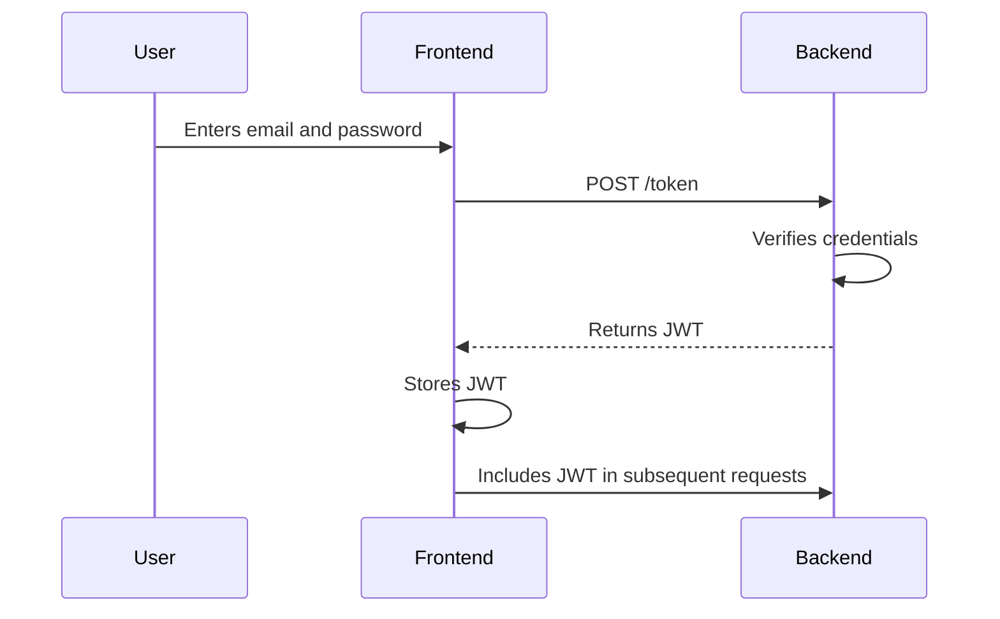

# 11. Backend Architecture

## 11.1. Service Architecture

### Traditional Server

#### Controller/Route Organization

```
api/
├── main.py
├── routers/
│   ├── auth.py
│   └── tasks.py
├── models.py
├── schemas.py
└── database.py
```

#### Controller Template

```python
# routers/tasks.py
from fastapi import APIRouter, Depends
from sqlalchemy.orm import Session
from .. import schemas
from ..database import get_db

router = APIRouter()

@router.get("/tasks", response_model=list[schemas.Task])
def read_tasks(db: Session = Depends(get_db)):
    # ...
    return tasks
```

## 11.2. Database Architecture

### Schema Design

```sql
CREATE TABLE users (
    id SERIAL PRIMARY KEY,
    email VARCHAR(255) UNIQUE NOT NULL,
    hashed_password VARCHAR(255) NOT NULL
);

CREATE TABLE tasks (
    id SERIAL PRIMARY KEY,
    description TEXT NOT NULL,
    category VARCHAR(255) NOT NULL,
    deadline TIMESTAMP NOT NULL,
    status VARCHAR(255) NOT NULL DEFAULT 'To Do',
    user_id INTEGER NOT NULL,
    FOREIGN KEY (user_id) REFERENCES users (id)
);
```

### Data Access Layer

```python
# crud.py
from sqlalchemy.orm import Session
from . import models, schemas

def get_user_by_email(db: Session, email: str):
    return db.query(models.User).filter(models.User.email == email).first()

def create_user(db: Session, user: schemas.UserCreate):
    # ...
    db.add(db_user)
    db.commit()
    db.refresh(db_user)
    return db_user
```

## 11.3. Authentication and Authorization

### Auth Flow



### Middleware/Guards

```python
# dependencies.py
from fastapi import Depends, HTTPException
from fastapi.security import OAuth2PasswordBearer
from jose import JWTError, jwt
from . import schemas


oauth2_scheme = OAuth2PasswordBearer(tokenUrl="token")

def get_current_user(token: str = Depends(oauth2_scheme)):
    # ...
    return user
```

---
