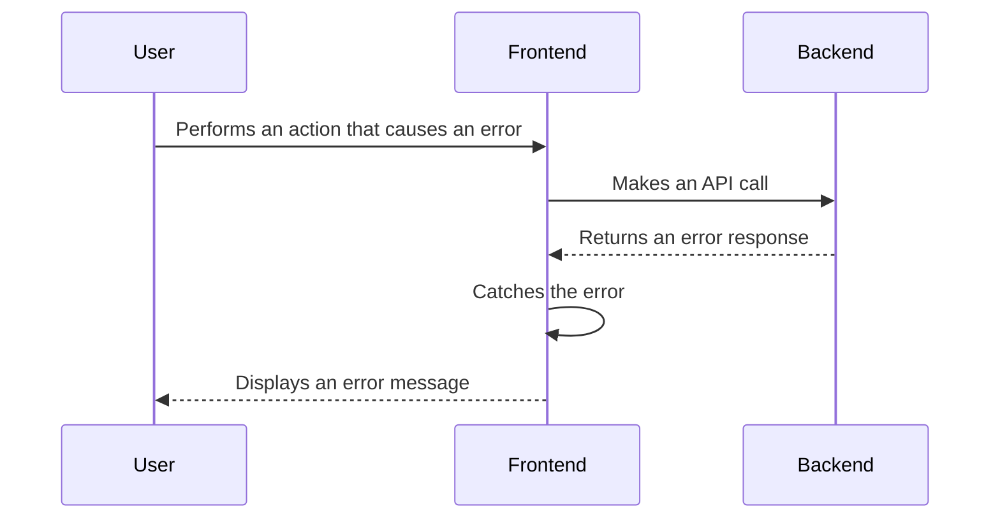

# 18. Error Handling Strategy

## 18.1. Error Flow



## 18.2. Error Response Format

```typescript
interface ApiError {
  error: {
    code: string;
    message: string;
    details?: Record<string, any>;
    timestamp: string;
    requestId: string;
  };
}
```

## 18.3. Frontend Error Handling

```typescript
// services/taskService.ts
import api from '@/lib/api';
import { Task } from '@/types';

export const getTasks = async (): Promise<Task[]> => {
  try {
    const response = await api.get('/tasks');
    return response.data;
  } catch (error) {
    // Handle error
    throw error;
  }
};
```

## 18.4. Backend Error Handling

```python
# main.py
from fastapi import FastAPI, Request
from fastapi.responses import JSONResponse

app = FastAPI()

@app.exception_handler(Exception)
async def unicorn_exception_handler(request: Request, exc: Exception):
    return JSONResponse(
        status_code=500,
        content={"message": f"Oops! {exc} did something wrong."},
    )
```

---
