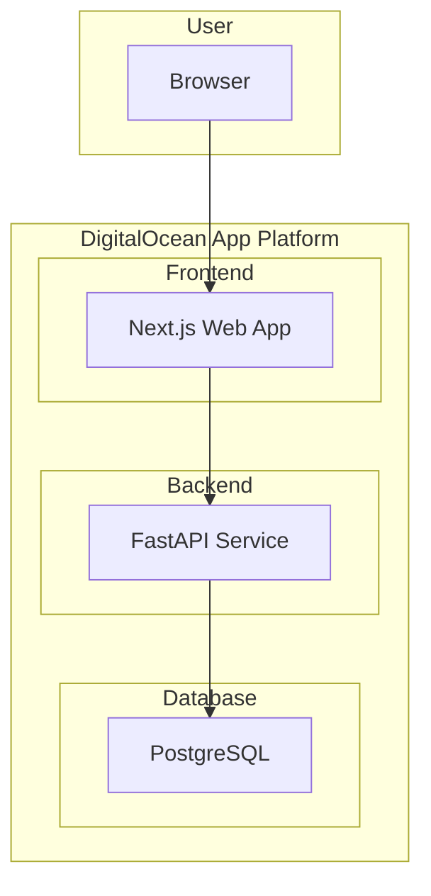

# 2. High Level Architecture

## 2.1. Technical Summary

The architecture for "The Motivational To-Do App" is a modern, full-stack, monolithic application designed for rapid development and deployment. The frontend will be a responsive Next.js web application, providing a dynamic and engaging user experience. The backend will be a lightweight and performant FastAPI application, serving a RESTful API to the frontend. The entire application will be hosted on the DigitalOcean App Platform, which simplifies the deployment and scaling of both the frontend and backend services. This architecture directly supports the PRD's goal of creating a simple, fast, and motivating to-do application for students.

## 2.2. Platform and Infrastructure Choice

**Platform:** DigitalOcean App Platform
**Key Services:**
*   **Web Service (Frontend):** For hosting the Next.js application.
*   **Web Service (Backend):** For hosting the FastAPI application.
*   **Database Service:** For a managed PostgreSQL database (as a more robust alternative to SQLite in production).
**Deployment Host and Regions:** US East (New York)

## 2.3. Repository Structure

**Structure:** Monorepo
**Monorepo Tool:** npm workspaces
**Package Organization:**
*   `apps/web`: The Next.js frontend application.
*   `apps/api`: The FastAPI backend application.
*   `packages/shared`: Shared code, such as TypeScript types, between the frontend and backend.

## 2.4. High Level Architecture Diagram

## 2.5. Architectural Patterns

-   **Jamstack Architecture:** The frontend will be a static-first, progressively enhanced application, leveraging the benefits of Next.js for performance and scalability. - _Rationale:_ This is a natural fit for Next.js and provides a fast user experience.
-   **Component-Based UI:** The frontend will be built with reusable React components, ensuring a modular and maintainable codebase. - _Rationale:_ This is a standard and effective pattern for building modern web applications.
-   **Repository Pattern:** The backend will use the repository pattern to abstract data access logic, making it easier to test and maintain. - _Rationale:_ This will decouple the business logic from the data access logic, improving the overall design of the backend.
-   **API Gateway Pattern:** While not a separate service in this monolith, the FastAPI application will act as a single entry point for all API calls, providing a centralized location for authentication, validation, and other cross-cutting concerns. - _Rationale:_ This simplifies the frontend's interaction with the backend and provides a clear and consistent API.

---
