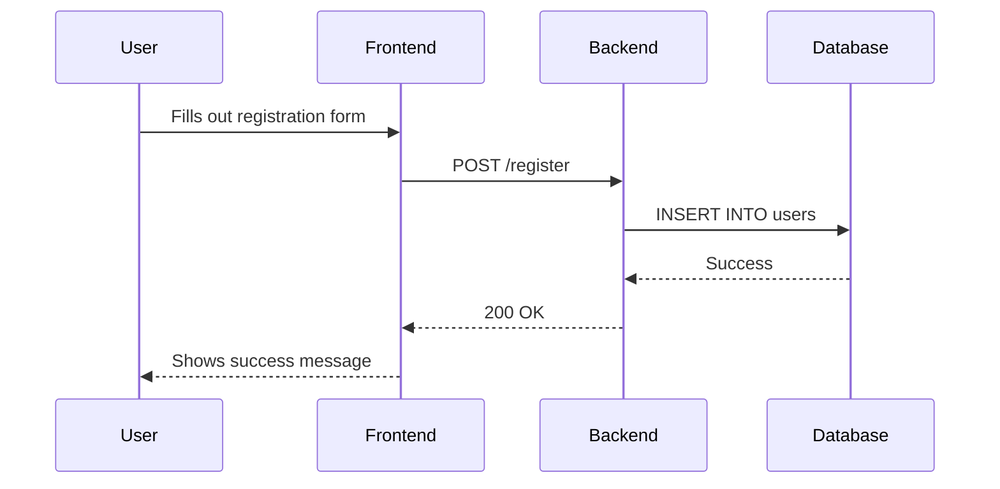
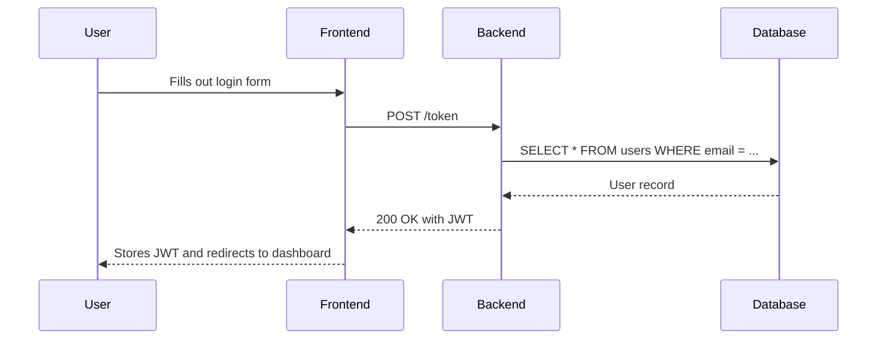
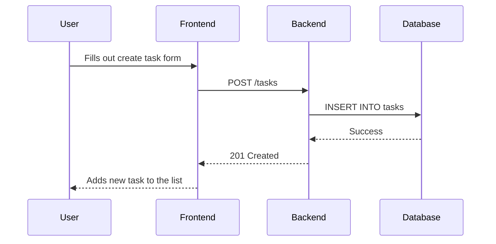

# 8. Core Workflows

## 8.1. User Registration

```mermaid
sequenceDiagram
    participant User
    participant Frontend
    participant Backend
    participant Database

    User->>Frontend: Fills out registration form
    Frontend->>Backend: POST /register
    Backend->>Database: INSERT INTO users
    Database-->>Backend: Success
    Backend-->>Frontend: 200 OK
    Frontend-->>User: Shows success message
```

## 8.2. User Login

```mermaid
sequenceDiagram
    participant User
    participant Frontend
    participant Backend
    participant Database

    User->>Frontend: Fills out login form
    Frontend->>Backend: POST /token
    Backend->>Database: SELECT * FROM users WHERE email = ...
    Database-->>Backend: User record
    Backend-->>Frontend: 200 OK with JWT
    Frontend-->>User: Stores JWT and redirects to dashboard
```

## 8.3. Create Task

```mermaid
sequenceDiagram
    participant User
    participant Frontend
    participant Backend
    participant Database

    User->>Frontend: Fills out create task form
    Frontend->>Backend: POST /tasks
    Backend->>Database: INSERT INTO tasks
    Database-->>Backend: Success
    Backend-->>Frontend: 201 Created
    Frontend-->>User: Adds new task to the list
```

---
