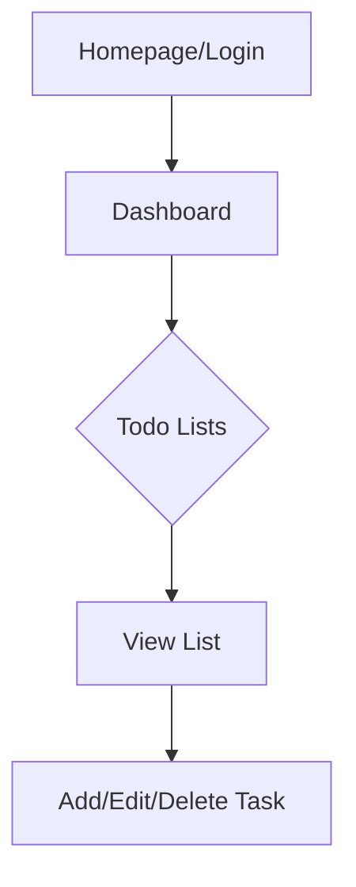
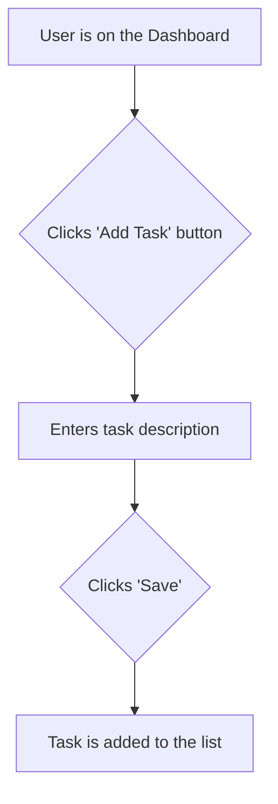

# simple-todo UI/UX Specification

## Introduction

This document defines the user experience goals, information architecture, user flows, and visual design specifications for simple-todo's user interface. It serves as the foundation for visual design and frontend development, ensuring a cohesive and user-centered experience.

### Overall UX Goals & Principles

#### Target User Personas

- **Busy Professional:** Needs a quick and easy way to manage daily tasks and stay organized.
- **Student:** Wants to keep track of assignments, deadlines, and study schedules.
- **Home Organizer:** Manages household chores, shopping lists, and family schedules.

#### Usability Goals

- **Ease of learning:** New users can create a new todo list and add an item in under 1 minute.
- **Efficiency of use:** Users can add, edit, and complete tasks with a minimal number of clicks.
- **Memorability:** Infrequent users can return to the app and remember how to use it without re-learning.

#### Design Principles

1.  **Simplicity:** The interface should be clean, uncluttered, and easy to understand.
2.  **Clarity:** Information should be presented in a clear and concise way.
3.  **Efficiency:** The app should help users complete their tasks as quickly as possible.

### Change Log

| Date       | Version | Description              | Author |
| :--------- | :------ | :----------------------- | :----- |
| 2025-08-28 | 1.0     | Initial draft            | Sally  |

## Information Architecture (IA)

### Site Map / Screen Inventory

### Navigation Structure

**Primary Navigation:** The primary navigation will be a simple top bar with the app name and a user menu.

**Secondary Navigation:** Not applicable for this simple application.

**Breadcrumb Strategy:** No breadcrumbs are necessary.

## User Flows

### Flow: Add a new Todo Item

**User Goal:** To add a new task to a todo list.

**Entry Points:** From the main dashboard view of a todo list.

**Success Criteria:** The new task is added to the list and displayed on the screen.

#### Flow Diagram

#### Edge Cases & Error Handling:

- If the task description is empty, show an error message.
- If there is a network error, show an error message and allow the user to retry.

**Notes:** The process should be as quick and seamless as possible.

## Wireframes & Mockups

**Primary Design Files:** [Link to Figma/Sketch file]

### Key Screen Layouts

#### Screen: Dashboard

**Purpose:** To display the user's todo lists and allow them to add new tasks.

**Key Elements:**
- List of todo lists
- "Add Task" button
- Individual task items with checkboxes

**Interaction Notes:** Clicking on a task marks it as complete.

**Design File Reference:** [Link to specific frame]

## Component Library / Design System

**Design System Approach:** We will use a simple set of reusable components based on a popular CSS framework like Bootstrap or Tailwind CSS.

### Core Components

#### Component: Button

**Purpose:** To trigger actions.

**Variants:** Primary, Secondary, Destructive.

**States:** Default, Hover, Disabled.

**Usage Guidelines:** Use primary buttons for the main call to action.

## Branding & Style Guide

**Brand Guidelines:** [Link to brand guidelines if they exist]

### Color Palette

| Color Type | Hex Code | Usage                               |
| :--------- | :------- | :---------------------------------- |
| Primary    | #007bff  | Buttons, links, and active elements |
| Secondary  | #6c757d  | Secondary text, borders             |
| Accent     | #17a2b8  | Highlights and special elements     |
| Success    | #28a745  | Positive feedback, confirmations    |
| Warning    | #ffc107  | Cautions, important notices         |
| Error      | #dc3545  | Errors, destructive actions         |
| Neutral    | #f8f9fa  | Text, borders, backgrounds          |

### Typography

#### Font Families

- **Primary:** "Roboto", sans-serif
- **Secondary:** N/A
- **Monospace:** "Roboto Mono", monospace

#### Type Scale

| Element | Size  | Weight | Line Height |
| :------ | :---- | :----- | :---------- |
| H1      | 2.5rem | 700    | 1.2         |
| H2      | 2rem   | 700    | 1.2         |
| H3      | 1.75rem| 700    | 1.2         |
| Body    | 1rem   | 400    | 1.5         |
| Small   | 0.875rem| 400    | 1.5         |

### Iconography

**Icon Library:** Font Awesome

**Usage Guidelines:** Use icons to supplement text and improve visual communication.

### Spacing & Layout

**Grid System:** 12-column flexible grid.

**Spacing Scale:** 8px base unit.

## Accessibility Requirements

### Compliance Target

**Standard:** WCAG 2.1 AA

### Key Requirements

**Visual:**
- Color contrast ratios: Minimum 4.5:1 for normal text and 3:1 for large text.
- Focus indicators: All interactive elements must have a visible focus indicator.
- Text sizing: Users should be able to resize text up to 200% without loss of content or functionality.

**Interaction:**
- Keyboard navigation: All functionality should be accessible via keyboard.
- Screen reader support: The application should be compatible with popular screen readers.
- Touch targets: Touch targets should be at least 44x44 pixels.

**Content:**
- Alternative text: All images should have descriptive alt text.
- Heading structure: Headings should be used in a logical order.
- Form labels: All form fields should have associated labels.

### Testing Strategy

We will use a combination of automated and manual testing to ensure accessibility.

## Responsiveness Strategy

### Breakpoints

| Breakpoint | Min Width | Max Width | Target Devices |
| :--------- | :-------- | :-------- | :------------- |
| Mobile     | 320px     | 767px     | Smartphones    |
| Tablet     | 768px     | 1023px    | Tablets        |
| Desktop    | 1024px    | 1439px    | Laptops        |
| Wide       | 1440px    | -         | Large monitors |

### Adaptation Patterns

**Layout Changes:** The layout will adapt to different screen sizes, from a single column on mobile to multiple columns on desktop.

**Navigation Changes:** The navigation will be a mobile-friendly menu on smaller screens.

**Content Priority:** The most important content will be displayed first on all devices.

**Interaction Changes:** Interactions will be optimized for touch on mobile devices.

## Animation & Micro-interactions

### Motion Principles

Animations should be subtle and purposeful, providing feedback to the user without being distracting.

### Key Animations

- **Task completion:** A subtle animation to indicate that a task has been completed.

## Performance Considerations

### Performance Goals

- **Page Load:** The application should load in under 2 seconds on a 3G connection.
- **Interaction Response:** Interactions should be acknowledged in under 100ms.
- **Animation FPS:** Animations should run at a smooth 60 frames per second.

### Design Strategies

We will use techniques like code splitting, lazy loading, and image optimization to improve performance.

## Next Steps

### Immediate Actions

1.  Review the UI/UX specification with stakeholders.
2.  Create visual designs in Figma.
3.  Handoff to the development team.

### Design Handoff Checklist

- [x] All user flows documented
- [x] Component inventory complete
- [x] Accessibility requirements defined
- [x] Responsive strategy clear
- [x] Brand guidelines incorporated
- [x] Performance goals established

## Checklist Results
